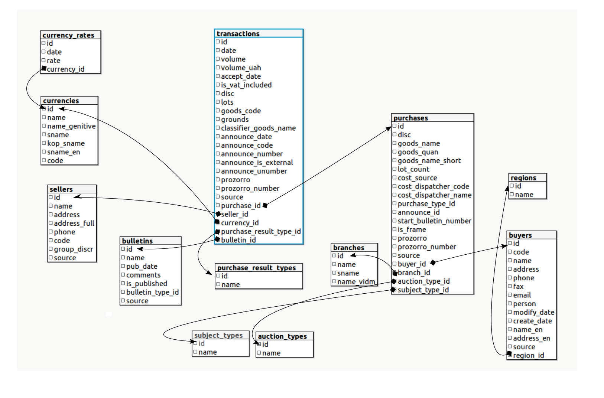

# Дамп бази державних закупівель [z.texty.org.ua](http://z.texty.org.ua)

## Що у цих даних?
Це текстовий дамп PostgreSQL з усіма угодами по державним тендерам, починаючи з 2008 року і до 05 вересня 2016-го, включно з угодами на Prozorro. Точніше, майже усіма - є невелика дірка в 2.5 місяці, з березня по травень 2015-го (ми все ще віримо у те, що нам вдасться отримати відсутні дані від "Вісника Державних Закупівель"). 

Фактично, це база даних (БД) на якій працює наша веб-програма [z.texty.org.ua](http://z.texty.org.ua). Схема БД розроблена журналістами даних ТЕКСТІВ так, щоб спростити та об"єднати існуючі офіційні бази і показати лише необхідний мінімум (напр. ЄДРПУО, ціна контракту, короткий опис, тощо). [Історія питання.](http://texty.org.ua/pg/article/txts/read/69511/z_for_zAKUPIVLI_Jak_my_stvoryly_vebaplikaciju?a_offset=)

## Де скачати?
За цим лінком: http://z.texty.org.ua/data/dump.sql.gz (~86 МБт у запакованому вигляді)

## Як встановити дамп

1. Встановіть PostgreSQL >=9.5
2. Створіть базу даних `tenders`

```sql
\c postgres
DROP DATABASE IF EXISTS tenders;
CREATE DATABASE tenders;
```
3. Імпортуйте дамп
```sql
psql tenders < z_dump.sql
```

## Опис таблиць



Загалом призначення полів випливають із їх назв. Тому далі будуть описані найнеочевидніші

### `transactions`
Таблиця транзакцій (угод, контрактів)

* `volume` - сума у валюті транзакції
* `volume_uah` - сума у перерахунку на гривню по курсу НБУ на дату транзакції
* `is_vat_included` - чи включено ПДВ
* `prozorro` - id об'єкта [`contract`](http://api-docs.openprocurement.org/en/latest/standard/contract.html) із БД prozorro
* `prozorro_number` - contractID контракту із БД prozorro (наприклад UA-2016-05-20-000180-b-c1)
* `source`
  * `ora` якщо контракт із оракла
  * `prozorro` якщо із prozorro
  * `*.xml` - якщо із xml-дампів вісника 

### `purchases`
Таблиця закупівель. Закупівля, це деяке узагальненя транзакції (угоди). Одна закупівля може мати декілька угод, укладаних із різними постачальниками (sellers), але завжди має єдиного замовника (buyer).

* `goods_name` - предмет закупівлі
* `prozorro` - id об'єкта [`tender`](http://api-docs.openprocurement.org/en/latest/standard/tender.html) із БД prozorro
* `prozorro_number` - tenderID закупівлі із БД prozorro (наприклад UA-2016-05-20-000180-b)
* `source` - джерело даних (аналогічно таблиці transactions)

### `buyers`
Таблиця замовників (покупців)

* `code` - код ЄДРПОУ або ІПН (фізичної або юридичної особи). в окремих випадках вказують іноземні коди

### `sellers`
Таблиця постачальників (продавців)

* `code` - код ЄДРПОУ або ІПН (фізичної або юридичної особи). в окремих випадках вказують іноземні коди

### `bulletins`
Бюлетені вісника державних закупівель (якщо тендер із Зовнішторгвидаву)


## Кого дякувати, якщо ви будете використовувати ці дані?
Приймемо із вдячністю  згадку про команду [Texty.org.ua](http://texty.org.ua), яка витрачає кращі години життя щоб із ~~гів...~~, вибачте, із *"умовно-відкритих"* даних зробити **відкриті**. 
